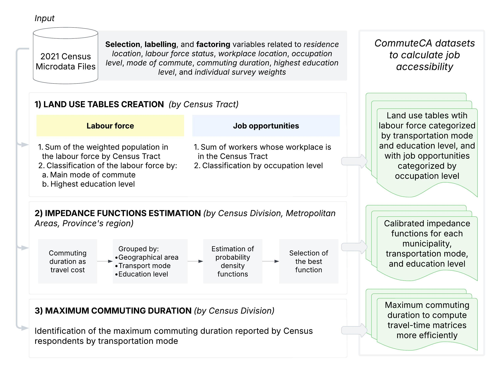

<!-- README.md is generated from README.Rmd. Please edit that file -->

```{r, include = FALSE}
knitr::opts_chunk$set(
  collapse = TRUE,
  comment = "#>",
  fig.path = "man/figures/README-",
  out.width = "100%"
)
```

<!-- badges: start -->

<!-- badges: end -->

# CommuteCA

The [**CommuteCA**](https://github.com/dias-bruno/CommuteCA) R package
was created to provide analysis-ready datasets from the [*2021 Census of
Population*](https://www12.statcan.gc.ca/census-recensement/index-eng.cfm),
along with standardized methods and customized functions for performing
urban accessibility in Canada. We focused our efforts on processing
variables from the [*Commuting Reference
Guide*](https://www12.statcan.gc.ca/census-recensement/2021/ref/98-500/011/98-500-x2021011-eng.cfm),
which provides valuable variables and information on commuting to work
for the Canadian population aged 15 and older living in private
households.

The name of the package, *CommuteCA*, references the commuting section
of the 2021 Canadian Census of Population. This package was created in
conjunction with the office of the [*Research Data Center* at *McMaster
University*](https://rdc.mcmaster.ca/), the [*Sherman Centre for Digital
Scholarship*](https://scds.ca/) and the [*Mobilizing
Justice*](https://mobilizingjustice.ca/).

The Mobilizing Justice project is a multidisciplinary and multi-sector
collaboration with the objective of understand and address
transportation poverty in Canada and to improve the well-being of
Canadians at risk of transport poverty. The Social Sciences and
Humanities Research Council (SSRHC) has provided funding for the
project, which was created by an unprecedented alliance of academics
from various Canadian provinces and institutions, transportation firms,
and nonprofit organizations.

## Structure

*CommuteCA* consists of a series of R datasets and R Markdown files
created to calculate job accessibility for any study area in Canada
using the 2021 Census of Population as the primary data source. The
source data (the demographic census) is restricted and requires
controlled access, meaning it must be processed within a Research Data
Center (RDC) office. The package includes datasets and R Markdown files
that enable accessibility analysis for two spatial units:

-   *Census Tracts*, available only for Census Metropolitan Areas and
    Census Agglomerations.
-   *Dissemination Areas*, a Statistics Canada spatial unit available
    nationwide.

For Census Tracts, the package provides datasets and R Markdown files
that allow researchers and transport practitioners to generate job
accessibility measures and maps without needing to visit an RDC office.

For Dissemination Areas, we developed R Markdown files that split the
process of calculating and analyzing accessibility metrics into distinct
steps. This structure simplifies data processing, given the restricted
nature of the source data.

### Data sets



The package contains a series of datasets for accessibility analysis and
other transportation studies. The datasets include calibrated impedance
functions for job destinations across walking, cycling, public transit,
and motorized vehicle modes, categorized or not by education level.
These functions are provided at three geographic levels: Census
Divisions (Municipality), Census Metropolitan Areas (CMA) and Census
Agglomerations (CA), and Census Metropolitan Influenced Zones within
Province and Territories.

The code bellow display the calibrated impedance functions for the City
of Toronto (Census Division Code (`PCD`) = `3520`):

```{r alberta-impedance-functions, warning=FALSE}
library("CommuteCA")
library("dplyr")

data("pcd_impedance_functions") # Load provincial impedance functions

pcd_impedance_functions %>% 
  filter(PCD == "3520") %>% # Filter for the City of Toronto
  dplyr::select(PCDNAME, PRNAME, PwMode_label, Distribution, est_1, est_2) # Display key columns
```

Another way to search for the functions is by using the
`search_impedance_function()` function from `CommuteCA`:

```{r}
search_impedance_function(code = 3520, type = "PCD")
```

To split the calibrated functions by education level:

```{r}
search_impedance_function(code = 3520, use_education = TRUE, type = "PCD")
```

Next, you can use the `generate_impedance()` function to calculate the
impedance value given a travel cost (duration):

```{r echo=TRUE}
specific_function <- search_impedance_function(code = 3520, 
                                               use_education = TRUE,
                                               type = "PCD")
max_dur <- 90 

expanded_df <- specific_function %>%
  slice(rep(seq_len(nrow(.)), each = max_dur)) %>%
  mutate(t = rep(seq_len(max_dur), times = nrow(specific_function)))

tld_theoretical <- generate_impedance(df = expanded_df,
                                      travel_cost_col = "t",
                                      distribution_col = "Distribution",
                                      est1_col = "est_1",
                                      est2_col = "est_2",
                                      output_col = "f")

head(tld_theoretical)
```

The package also includes land use tables with labour force population
and job counts for census tracts. The code below visualizes Toronto's
labour force by transportation mode for some census tracts:

```{r warning=FALSE}
data("labour_force_CT_mode") # Land Use data with information of labour force considering transportation modes

labour_force_3520 <- labour_force_CT_mode %>%
  filter(PCD == 3520) %>% # Filtering data for the city of Toronto
  dplyr::select(CTUID, PwMode_label, labour_force_rounded)

head(labour_force_3520)
```

Now, the job opportunities:

```{r warning=FALSE}
data("jobs_CT_general") # Land Use data with information of number of jobs

jobs_3520 <- jobs_CT_general %>%
  filter(PCD == 3520) %>% # Filtering data for the city of Toronto
  dplyr::select(CTUID, jobs_rounded)

head(jobs_3520)
```

These datasets enable census tract-level accessibility analysis. For
instance, we can use these two datasets to calculate the gravity-based
accessibility by [Hansen
(1959)](ttps://doi.org/10.1080/01944365908978307) and (multimodal)
spatial availability by [Soukhov et al.
(2024)](https://doi.org/10.1371/journal.pone.0299077):


### Explanation of the R markdown Templates


The {CommuteCA} package includes R Markdown templates that guide users
through the entire accessibility analysis workflow. As illustrated in
Figure \ref{fig:templates-figure}, these templates enable analysts to:

-   Mode job accessibility at the Census Tract (CT) level for multiple
    CMAs and CAs without requiring special access to confidential census
    microdata files.
-   Model job accessibility at the Dissemination Area (DA) level for any
    study area in Canada, including areas outside metropolitan regions.
    Exclusively for researchers with access to census microdata files.

The R Markdown files are available in the `/data-raw` folder if you
clone the repository from
[GitHub](https://github.com/dias-bruno/CommuteCA). If you have installed
the package, you can access the R Markdown templates in `RStudio` by
navigating to `File > New File > R Markdown... > From Template` and
selecting one of the *CommuteCA* R Markdown templates.

The package provides seven (for now) R Markdown templates, organized
into three progressive groups:

-   **Group 1: Introduction to R (Templates 1 to 2):**
    -   Template 1: To introduces the R language, literate programming
        concepts, data objects, basic operations, measurement scales,
        and fundamental data manipulation techniques.
    -   Template 2: To perform exploratory data analysis, including
        descriptive statistics and appropriate visualizations for
        different variable types.
-   **Group 2: Accessibility Modelling (Templates 3 to 5)**
    -   Template 3: To obtain spatial files via the {cancensus} package,
        and generating travel-time matrices using the {r5r} routing
        engine.
    -   Template 4: To calculate job accessibility using both the
        traditional Hansen accessibility measure (gravity model) and the
        spatial availability model proposed by Soukhov et al. (2023).
    -   Template 5: To create maps to visualize job accessibility
        indicators.
-   **Group 3: Assessing Accessibility (Templates 6 to 7)**
    -   Template 6: To construct spatial filters for accessibility
        indicators.
    -   Template 7: To estimate regression models that link
        accessibility to employment outcomes.

## Installation

You can install the development version of *CommuteCA* from:

``` r
install.packages("pak")
pak::pak("dias-bruno/CommuteCA")
```
