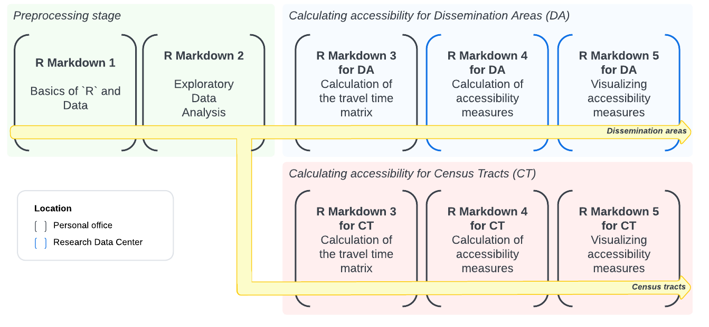
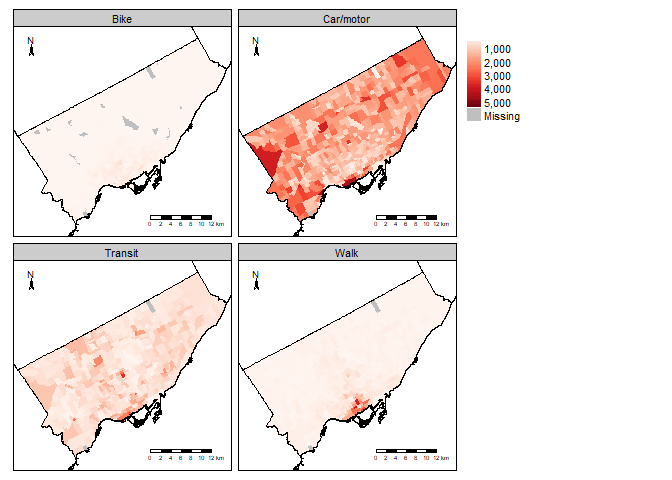
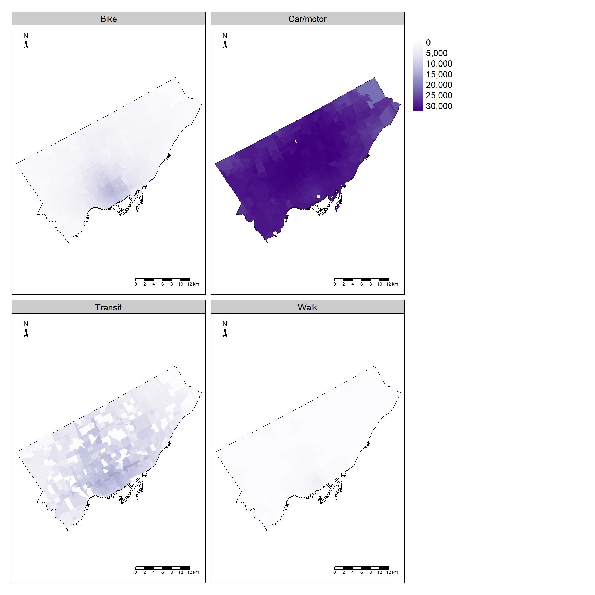
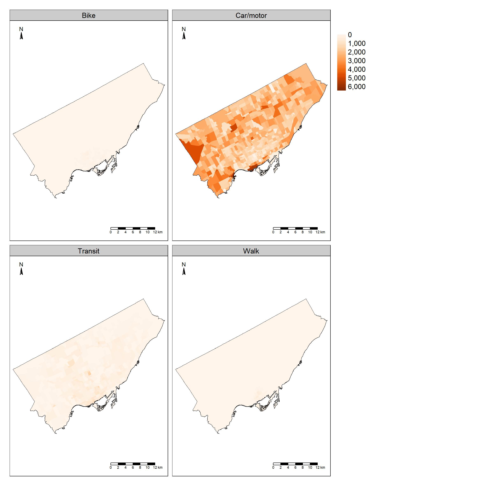

<!-- README.md is generated from README.Rmd. Please edit that file -->

# CommuteCA

The [**CommuteCA**](https://github.com/dias-bruno/CommuteCA) R package
was created to develop standardized methods for transport analysis in
research, particularly for analysis using the [*2021 Census of
Population*](https://www12.statcan.gc.ca/census-recensement/index-eng.cfm)
from Statistics Canada. We focused our efforts on the [*Commuting
Reference
Guide*](https://www12.statcan.gc.ca/census-recensement/2021/ref/98-500/011/98-500-x2021011-eng.cfm),
which provides valuable variables and information on commuting for the
Canadian population aged 15 and older living in private households.

The name of the package, *CommuteCA*, references the commuting section
of the 2021 Canadian Census of Population. This package was created in
conjunction with the office of the [*Research Data Center* at *McMaster
University*](https://rdc.mcmaster.ca/), the [*Sherman Centre for Digital
Scholarship*](https://scds.ca/) and the [*Mobilizing
Justice*](https://mobilizingjustice.ca/).

The Mobilizing Justice project is a multidisciplinary and multi-sector
collaboration with the objective of understand and address
transportation poverty in Canada and to improve the well-being of
Canadians at risk of transport poverty. The Social Sciences and
Humanities Research Council (SSRHC) has provided funding for the
project, which was created by an unprecedented alliance of academics
from various Canadian provinces and institutions, transportation firms,
and nonprofit organizations.

## Structure

*CommuteCA* consists of a series of R datasets and R Markdown files
created to calculate job accessibility analyses for any city in Canada
using the 2021 Census of Population as the primary data source. The
source data (the demographic census) is restricted and requires
controlled access, meaning it must be processed within a Research Data
Center (RDC) office. The package includes datasets and R Markdown files
that enable accessibility analysis for two spatial units:

- *Dissemination Areas*, a Statistics Canada spatial unit available
  nationwide.
- *Census Tracts*, available only for Census Metropolitan Areas and
  Census Agglomerations.

For Census Tracts, the package provides datasets and R Markdown files
that allow researchers and transport practitioners to generate job
accessibility measures and maps without needing to visit an RDC office.

For Dissemination Areas, we developed R Markdown files that split the
process of calculating and analyzing accessibility metrics into distinct
steps. This structure simplifies data processing, given the restricted
nature of the source data.

### Explanation of the R markdown files

The figure below shows the order in which the R Markdown files are
executed. For the Dissemination Area spatial unit, only the fourth and
fifth steps - *“Calculation of accessibility measures”* and
*“Visualizing accessibility measures”* - must be executed within an RDC
office when working with original data from the Census of Population. To
make the methodology easier to understand, we provide a test dataset
derived from the demographic census, containing a selection of
variables. This allows researchers to test and refine the methodology
before processing the original data in an RDC office.

<figure>

<figcaption aria-hidden="true">Execution order to obtain accessibility
analysis.</figcaption>
</figure>

The R Markdown files are available in the `/data-raw` folder if you
clone the repository from
[GitHub](https://github.com/dias-bruno/COMMUTECA). If you have installed
the package, you can access the R Markdown templates in `RStudio` by
navigating to `File > New File > R Markdown... > From Template` and
selecting one of the *CommuteCA* R Markdown templates.

#### Basics of R and Data

This R markdown provides a brief introduction to the R language and data
concepts. It also talks about the principles of literate programming,
data objects and basic operations, ways of measuring things and data
manipulation.

#### Exploratory Data Analysis

This R markdown aims to provide a brief introduction to exploratory data
analysis (EDA). It also deals with descriptive statistics and
visualization techniques.

#### Travel Times

These R markdown files calculate a travel time matrix for multimodal
transport networks (walking, cycling, public transit and motorized
vehicles), for a selection of dissemination areas (DA) or census tract
(CT) using the [{r5r}](https://ipeagit.github.io/r5r/) R package.

#### Accessibility measures

Considering the number of workers and employment opportunities obtained
from the [*2021 Census of
Population*](https://www12.statcan.gc.ca/census-recensement/2021/dp-pd/prof/index.cfm?Lang=E),
this R markdown enables obtaining Hansen-type accessibility [(Hansen,
1959)](https://www.tandfonline.com/doi/abs/10.1080/01944365908978307)
and spatial availability [(Soukov and
Paez,2023)](https://journals.plos.org/plosone/article?id=10.1371/journal.pone.0278468),
for all Canadian provinces and territories, considering different modes
of transportation. For Dissemination Areas (DA), researchers must access
the original data within an RDC office. For Census Tracts (CT), the
package provides pre-processed datasets, allowing users to generate
accessibility measures without visiting an RDC office.

#### Visualizing accessibility measures

After obtained the accessibility measures for your region of interest,
this R markdown presents a methodology for visually displaying and
analyzing the data.

### Data sets

The package contains a series of datasets for accessibility analysis and
other transportation studies.

The datasets include calibrated impedance functions for job destinations
across walking, cycling, public transit, and motorized vehicle modes.
These functions are provided at three geographic levels: city, Census
Metropolitan Areas (CMA) and Census Agglomerations (CA) and Province and
Territories.

For provinces, the calibrated job impedance functions are split by
urbanity level or Indigenous Territory affiliation.

``` r
library('dplyr')
#> 
#> Attaching package: 'dplyr'
#> The following objects are masked from 'package:stats':
#> 
#>     filter, lag
#> The following objects are masked from 'package:base':
#> 
#>     intersect, setdiff, setequal, union
data("pr_impedance_functions") # Load provincial impedance functions

pr_impedance_functions %>% 
  filter(Pr == 'Alberta') %>% # Filter for Alberta
  select(Pr, CMA_type, PwMode, distribution, est_1, est_2) # Display key columns
#>         Pr                              CMA_type    PwMode distribution
#> 1  Alberta                                CMA/CA Car/motor        lnorm
#> 2  Alberta                                CMA/CA   Transit        gamma
#> 3  Alberta                                CMA/CA      Walk          exp
#> 4  Alberta                                CMA/CA      Bike        gamma
#> 5  Alberta Moderate metropolitan influenced zone Car/motor        lnorm
#> 6  Alberta Moderate metropolitan influenced zone      Walk        lnorm
#> 7  Alberta Moderate metropolitan influenced zone   Transit        gamma
#> 8  Alberta Moderate metropolitan influenced zone      Bike        lnorm
#> 9  Alberta     Weak metropolitan influenced zone Car/motor        lnorm
#> 10 Alberta     Weak metropolitan influenced zone      Walk        lnorm
#> 11 Alberta     Weak metropolitan influenced zone      Bike        lnorm
#> 12 Alberta     Weak metropolitan influenced zone   Transit        gamma
#> 13 Alberta   Strong metropolitan influenced zone Car/motor        gamma
#> 14 Alberta   Strong metropolitan influenced zone      Walk        lnorm
#> 15 Alberta   Strong metropolitan influenced zone      Bike         unif
#> 16 Alberta   Strong metropolitan influenced zone   Transit          exp
#> 17 Alberta       No metropolitan influenced zone Car/motor          exp
#> 18 Alberta       No metropolitan influenced zone      Walk        lnorm
#> 19 Alberta       No metropolitan influenced zone   Transit        gamma
#>         est_1       est_2
#> 1  2.85460050  0.68852960
#> 2  2.89128944  0.06843334
#> 3  0.07527407  0.00000000
#> 4  2.27164673  0.10593182
#> 5  2.77916345  0.86349605
#> 6  1.60573174  1.05103395
#> 7  1.54061890  0.03805530
#> 8  2.07416320  0.79410686
#> 9  2.46235874  0.97471122
#> 10 1.81993182  0.96358833
#> 11 2.00735531  0.80808469
#> 12 1.24639321  0.02346271
#> 13 1.38546874  0.05002713
#> 14 1.05911762  1.28742159
#> 15 0.00000000 35.10561417
#> 16 0.02640051  0.00000000
#> 17 0.04703065  0.00000000
#> 18 1.38831321  0.79033268
#> 19 3.25054825  0.08020833
```

The package also includes land use tables with labor force population
and job counts for census tracts. The code below visualizes Toronto’s
labour force distribution by transportation mode:

``` r
library("CommuteCA")
library("sf")
#> Linking to GEOS 3.11.2, GDAL 3.8.2, PROJ 9.3.1; sf_use_s2() is TRUE
library("tmap")
#> Breaking News: tmap 3.x is retiring. Please test v4, e.g. with
#> remotes::install_github('r-tmap/tmap')

data("census_tracts_ca21") # Census Tract Geometries
data("census_divisions_ca21") # Census Division geometries
data("land_use_CT_mode") # Land Use data with information of labour force and number of jobs considering transportation modes

census_tracts_ca21 <- census_tracts_ca21 %>% 
  filter(PCD == 3520) # Filtering data for the city of Toronto 

land_use_CT_mode <- land_use_CT_mode %>% 
  filter(PCD == 3520) %>% # Filtering data for the city of Toronto 
  select(CTUID, PwMode, labour_force_est_rounded, jobs_rounded)

# Joining both data sets
Toronto <- expand.grid(CTUID = unique(census_tracts_ca21$CTUID), 
              PwMode = unique(land_use_CT_mode$PwMode)) %>%
  left_join(land_use_CT_mode, by = c("CTUID" = "CTUID", "PwMode" = "PwMode")) %>%
  left_join(census_tracts_ca21, by = "CTUID")

Toronto <- st_as_sf(Toronto, crs = st_crs(census_tracts_ca21)) # transforming the table in a spatial data type

# Creating the plot
total_pop_by_mode_CT <- tm_shape(Toronto) + 
   tm_polygons("labour_force_est_rounded",
              style = "cont",
              palette = "Reds",
              title = " ",
              border.col = NULL) +  
   tm_facets(by = "PwMode") +       
   tm_scale_bar(position = c("right", "bottom")) +
   tm_compass(position = c("left", "top"), size = 1.0) + 
   tm_shape(census_divisions_ca21) +
   tm_borders("black", lwd=0.5)

# Visualizing
total_pop_by_mode_CT
```



These datasets enable census tract-level accessibility analysis. For
instance, the job accessibility for the city of Toronto (Hansen type):

<figure>

<figcaption aria-hidden="true">Job accessibility for the city of Toronto
(Hansen-type).</figcaption>
</figure>

Or the job spatial availability for the city of Toronto.

<figure>

<figcaption aria-hidden="true">Job accessibility for the city of Toronto
(Soukhov-type, spatial availability).</figcaption>
</figure>

## Installation

You can install the development version of *CommuteCA* from:

``` r
# install.packages("pak")
pak::pak("dias-bruno/commutecatest")
```
