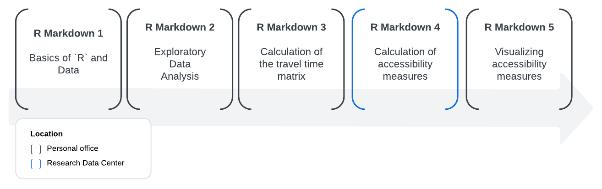

<!-- README.md is generated from README.Rmd. Please edit that file -->

# CommuteCA

The [**CommuteCA**](https://github.com/dias-bruno/CommuteCA) R package
was created to develop standardized methods for transport analysis in
research, especially for studies using Statistics Canada surveys. Among
the available surveys, we focused our efforts on the [*2021 Census of
Population*](https://www12.statcan.gc.ca/census-recensement/index-eng.cfm),
which contain valuable variables for transportation research. This
package was created in conjunction with the office of the [*Research
Data Center* at *McMaster University*](https://rdc.mcmaster.ca/), the
[*Sherman Centre for Digital Scholarship*](https://scds.ca/) and the
[*Mobilizing Justice*](https://mobilizingjustice.ca/).

The Mobilizing Justice project is a multidisciplinary and multi-sector
collaboration with the objective of understand and address
transportation poverty in Canada and to improve the well-being of
Canadians at risk of transport poverty. The Social Sciences and
Humanities Research Council (SSRHC) has provided funding for the
project, which was created by an unprecedented alliance of academics
from various Canadian provinces and institutions, transportation firms,
and nonprofit organizations.

## Structure

**CommuteCA** consists of five R markdown files, comprising all the
steps required to obtain accessibility analyses for any region in
Canada, using the 2021 Census of Population as the data source.

As the source data (the demographic census) is restricted and controlled
access data, it needs to be manipulated within a Research Data Center
(RDC) office. For this reason, we have created a methodology that splits
the process to obtain and analyze accessibility metrics into five parts,
with the objective of facilitating the data processing.

The figure below shows the order in which the R markdown files are
executed. Only the fourth step, *“Calculation of accessibility
measures”*, must be executed inside an RDC office if you want to work
with the original data from the Census of Population. In order to make
the methodology easier to understand, we have also provided a synthetic
data set from the demographic census, with a selection of variables so
the researcher can test and train the methodology before going to
process the original data in an RDC office.

<figure>

<figcaption aria-hidden="true">Order to run the R markdown
files.</figcaption>
</figure>

The R markdown files are available in the `/data-raw` folder.

## Explanation of the R markdown files

### Basics of R and Data

This R markdown provides a brief introduction to the R language and data
concepts. It also talks about the principles of literate programming,
data objects and basic operations, ways of measuring things and data
manipulation.

### Exploratory Data Analysis

This R markdown aims to provide a brief introduction to exploratory data
analysis (EDA). It also deals with descriptive statistics and
visualization techniques.

### Travel Times

This R markdown calculates a travel time matrix for multimodal transport
networks (walk, bike, public transport and car), for a selection of
dissemination areas (DA), using the
[{r5r}](https://ipeagit.github.io/r5r/) R package.

### Accessibility measures

Considering the number of workers and employment opportunities obtained
from the [*2021 Census of
Population*](https://www12.statcan.gc.ca/census-recensement/2021/dp-pd/prof/index.cfm?Lang=E),
this R markdown aims to create a methodology to obtain Hansen-type
accessibility (Hansen, 1959) and spatial accessibility (Soukov and Paez,
2023), for all Canadian provinces and territories, considering different
modes of travel.

### Visualizing accessibility measures

After obtained the accessibility measures for your region of interest,
this R markdown presents a methodology for visually displaying and
analyzing the data.

## Installation

You can install the development version of CommuteCA from:

``` r
# install.packages("devtools")
devtools::install_github("dias-bruno/CommuteCA")
```
